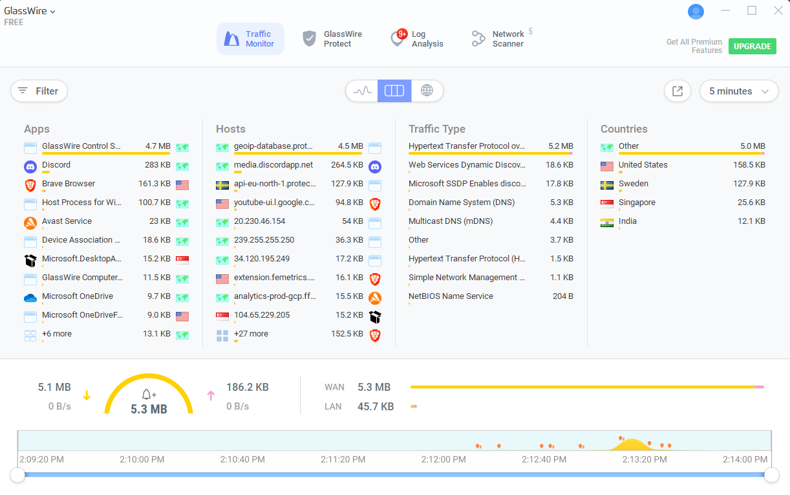
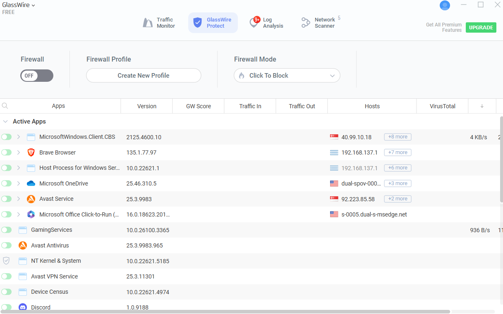
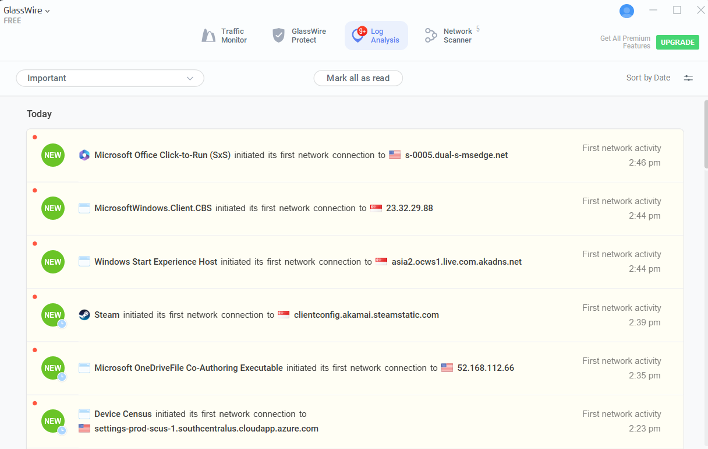

# GlassWire - Windows Network Monitoring Tool

## 📌 Overview
GlassWire is a free Windows network monitoring tool that shows live traffic, detects new connections, and alerts users of suspicious activity. This project uses GlassWire to demonstrate network surveillance, anomaly detection, and simulated intrusion response.

## 🖥️ Installation (Windows)
1. Download from: https://www.glasswire.com/download/
2. Run the installer and follow the default setup
3. Launch GlassWire – monitoring begins automatically

## ⚙️ Configurations Used
- Enabled alerts for new devices
- Graph set to real-time mode
- Monitored bandwidth by app and IP

## 🧪 Use Case Simulation
Simulated suspicious behavior using Angry IP Scanner:
- Scanned the local network
- GlassWire detected the new device and showed alerts in real time

## 📂 Project Files
- `glasswire-settings.txt` – Manual config snapshot
- `simulate-threat.txt` – Steps to simulate a network scan
- `document-findings.txt` – Full docs explaining issues and project findings
- `screenshots/` – Contains UI views (graph, alert, etc.)

## 📸 Screenshots

## 🛡️ Relevance to Cybersecurity
- Demonstrates network behavior monitoring
- Simulates threat detection
- Applies network defense principles covered in coursework

## 🧠 Note
Some features like full firewall control are only available in the Pro version, but this project uses only the free version to keep it accessible.

---
